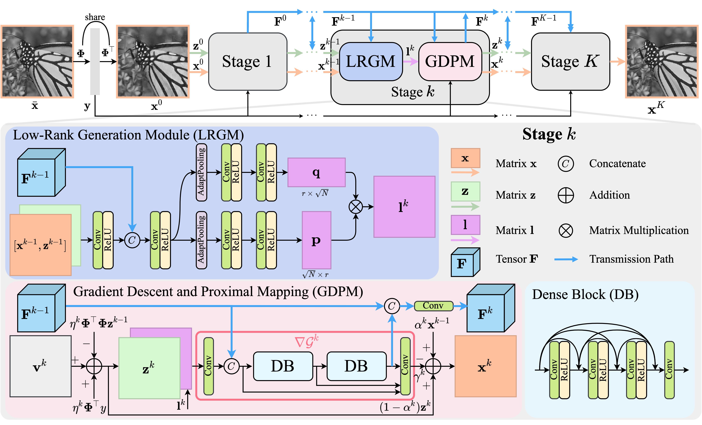
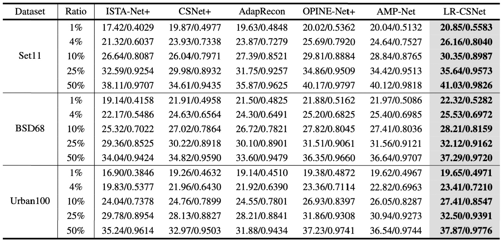

# LowRank-CSNet
📌 Official implementation of LR-CSNet: Low-Rank Deep Unfolding Network for Image Compressive Sensing

> [**LR-CSNet: Low-Rank Deep Unfolding Network for Image Compressive Sensing**](https://ieeexplore.ieee.org/document/10065722) <br>
> [Tianfang Zhang](https://tianfang-zhang.github.io/), [Lei Li](https://di.ku.dk/english/staff/?pure=en/persons/702491), [Christian Igel](https://christian-igel.github.io/), [Stefan Oehmcke](https://scholar.google.de/citations?user=k9EWJmcAAAAJ&hl=de), [Fabian Gieseke](https://scholar.google.de/citations?user=g3ZiieoAAAAJ&hl=de), [Zhenming Peng](https://idiplab.uestc.cn/queryNews?htmlid=1545286321065) <br>
> University of Electronic Science and Technology of China, University of Copenhagen

## Introduction 
We propose a DUN called low-rank CS network (LR-CSNet) for natural image CS. Real-world image patches are often well-represented by low-rank approximations. 
LR-CSNet exploits this property by adding a low-rank prior to the CS optimization task.
We derive a corresponding iterative optimization procedure using variable splitting, which is then translated to a new DUN architecture.
The architecture uses low-rank generation modules (LRGMs), which learn low-rank matrix factorizations, as well as gradient descent and proximal mappings (GDPMs), which are proposed to extract high-frequency features to refine image details.
In addition, the deep features generated at each reconstruction stage in the DUN are transferred between stages to boost the performance.
Our extensive experiments on three widely considered datasets demonstrate the promising performance of LR-CSNet compared to state-of-the-art methods in natural image CS.

## Network Architecture

<p align="center">
    
    <br> Figure 1. Illustration of the LR-CSNet network architecture and modules.
</p>
<p align="center">


## Test

Run the following command to evaluate a pre-trained LR-CSNet on a single GPU:

<pre>
python scripts/test_lowrankcsnet.py --data_dir {$my_data_dir} --pkl-path checkpoints/lowrankcsnet_cs25_stage9_glayer6_gchannel32_rank8.pkl --cs-ratio 25
</pre>

This should give:
<pre>
Data: set11, PSNR: 35.6371, SSIM: 0.9573
Data: bsd68, PSNR: 32.1164, SSIM: 0.9162
</pre>

Here are the command lines for evaluating other pre-trained models:
<pre>
python scripts/test_lowrankcsnet.py --data_dir {$my_data_dir} --pkl-path checkpoints/lowrankcsnet_cs{$cs_ratio}_stage9_glayer6_gchannel32_rank8.pkl --cs-ratio {$cs_ratio}
</pre>


## Train

Before training, please download [train data](https://drive.google.com/file/d/1NECjmVq5l_W6wR9U-yf0pJ3HdKU6HKHT/view?usp=sharing) and [finetune data](https://drive.google.com/file/d/11Rnq_Uai-8YHp0Mn2pIeZgmUxX_Qn9VQ/view?usp=sharing) from Google Drive.

To train a LR-CSNet model on a single GPU for 150 epochs and finetune 100 epochs, run:

<pre>
python scripts/train_lowrankcsnet.py --cs-ratio {$cs_ratio}
</pre>


## Result

<p align="center">
    Table 1. Quantitative comparison of average PSNR/SSIM for different CS ratios on the Set11, BSD68, and Urban100.<br>
    
</p>
<p align="center">


## Citation

```
@inproceedings{zhang2022lr,
  title={LR-CSNet: Low-Rank Deep Unfolding Network for Image Compressive Sensing},
  author={Zhang, Tianfang and Li, Lei and Igel, Christian and Oehmcke, Stefan and Gieseke, Fabian and Peng, Zhenming},
  booktitle={2022 IEEE 8th International Conference on Computer and Communications (ICCC)},
  pages={1951--1957},
  year={2022},
  organization={IEEE}
}
```
